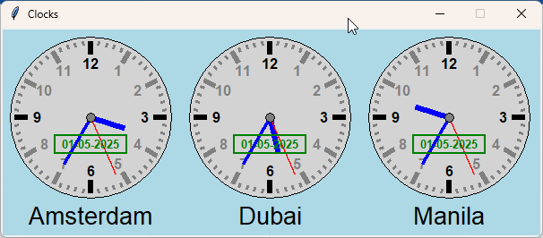

# World Clock: Manila – Dubai – Amsterdam

While waiting for my wife to travel from **Manila (Philippines)** to **Amsterdam (The Netherlands)**, I wanted a clock that could display the current local time in these locations. I also included **Dubai**, since her flight had a layover there.

I used **ChatGPT** to generate a Python script that displays **three analog clocks**, each showing the time in one of these cities. After some tweaking and customization, this is the final result.



## 🕒 Features

- Analog clocks for:
  - Manila (Philippines)
  - Dubai (UAE)
  - Amsterdam (Netherlands)
- Real-time updates
- Clean and simple graphical interface

## 💻 Requirements

- Python 3.x
- tkinter (usually included with Python)
- `pytz` and `datetime` libraries

Install required packages (if needed) via:

```bash
pip install pytz
